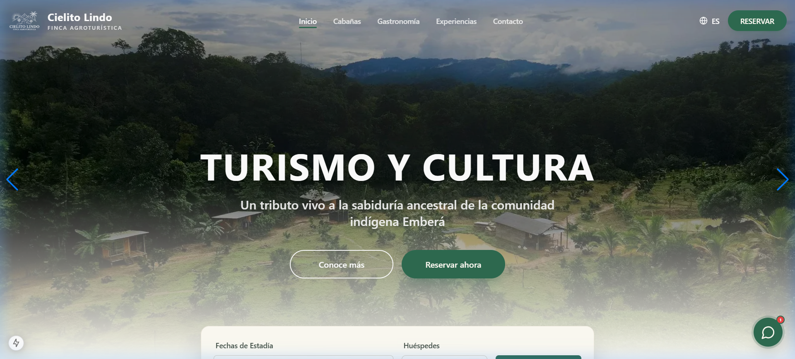
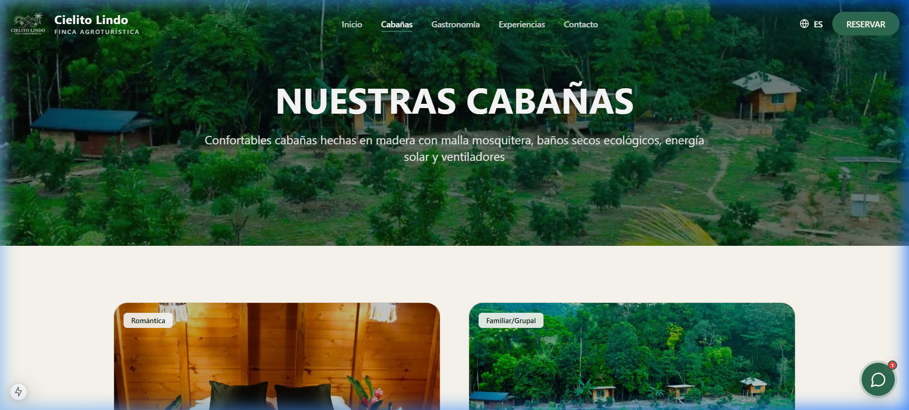
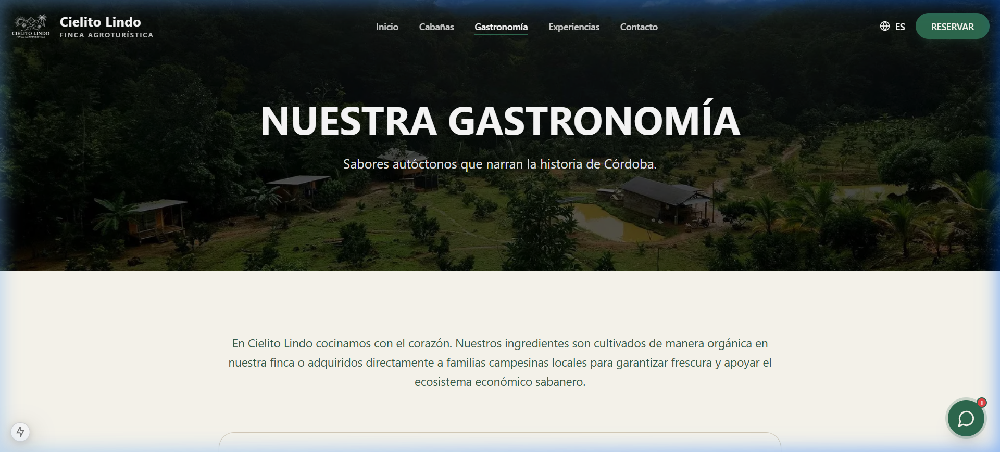
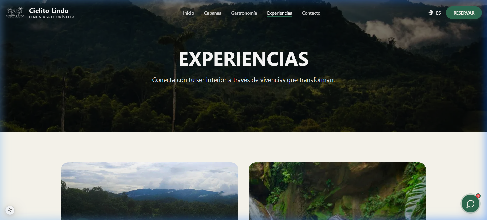
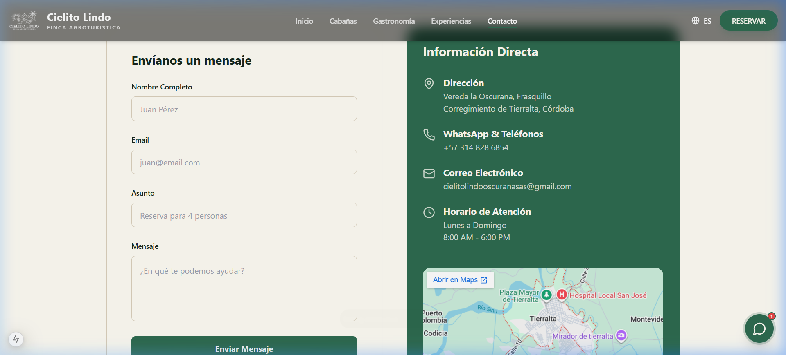

# 🌿 Cielito Lindo - Finca Agroturística

Cielito Lindo es una plataforma web moderna diseñada para la gestión y promoción de la **Finca Agroturística Cielito Lindo**. El proyecto ofrece una experiencia inmersiva para los usuarios que buscan conectar con la naturaleza, la cultura indígena Emberá y la gastronomía local.



## 🚀 Características

-   **Experiencia Visual Inmersiva:** Interfaz moderna y responsiva utilizando Next.js y Tailwind CSS.
-   **Gestión de Cabañas:** Catálogo detallado de cabañas con sistema de reservas integrado.
-   **Gastronomía y Cultura:** Secciones dedicadas a la oferta gastronómica y experiencias culturales (comunidad Emberá).
-   **Asistente Inteligente (AI):** Soporte integrado mediante un asistente de IA para resolver dudas de los visitantes.
-   **Panel de Administración:** Gestión interna de reservas y contenidos a través de un dashboard dedicado.
-   **Internacionalización (i18n):** Soporte multilingüe para visitantes internacionales.
-   **Integración con Supabase:** Backend robusto para la gestión de datos, autenticación y almacenamiento.

## 🛠️ Stack Tecnológico

-   **Framework:** [Next.js 15+](https://nextjs.org/) (App Router)
-   **Lenguaje:** [TypeScript](https://www.typescriptlang.org/)
-   **Estilos:** [Tailwind CSS](https://tailwindcss.com/)
-   **Componentes UI:** [Radix UI](https://www.radix-ui.com/) & [Shadcn/UI](https://ui.shadcn.com/)
-   **Animaciones:** [Framer Motion](https://www.framer.com/motion/)
-   **Base de Datos y Auth:** [Supabase](https://supabase.com/)
-   **Estado:** [Zustand](https://docs.pmnd.rs/zustand/getting-started/introduction)
-   **Formularios:** [React Hook Form](https://react-hook-form.com/) & [Zod](https://zod.dev/)

## 📸 Capturas de Pantalla

### Nuestras Cabañas


### Gastronomía


### Experiencias


### Contacto


## 📦 Instalación y Configuración

1.  **Clonar el repositorio:**
    ```bash
    git clone [url-del-repositorio]
    cd cielito-lindo
    ```

2.  **Instalar dependencias:**
    ```bash
    npm install
    ```

3.  **Configurar variables de entorno:**
    Crea un archivo `.env.local` en la raíz del proyecto con las siguientes claves:
    ```env
    NEXT_PUBLIC_SUPABASE_URL=tu_url_de_supabase
    NEXT_PUBLIC_SUPABASE_ANON_KEY=tu_anon_key
    ```

4.  **Ejecutar en desarrollo:**
    ```bash
    npm run dev
    ```
    La aplicación estará disponible en `http://localhost:3000`.

## 🗄️ Estructura del Proyecto

-   `src/app`: Rutas y páginas de la aplicación (App Router).
-   `src/components`: Componentes reutilizables, organizados por funcionalidad (UI, layout, sections, ai, booking).
-   `src/hooks`: Hooks personalizados de React.
-   `src/lib`: Utilidades y configuraciones (Supabase client, etc).
-   `src/stores`: Gestión de estado con Zustand.
-   `supabase/migrations`: Migraciones de la base de datos para replicar el esquema.

---

Desarrollado con ❤️ para **Cielito Lindo Finca Agroturística**.
